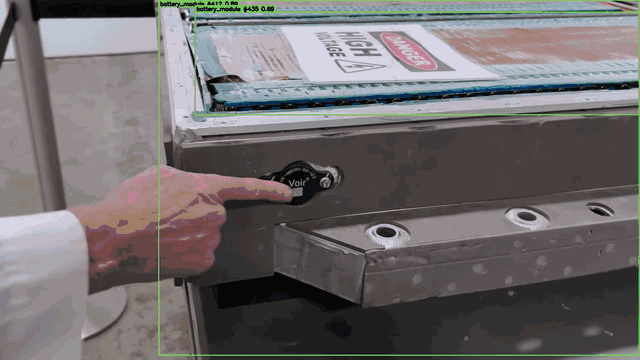

# EV Battery Component Detector



Computer vision system for detecting EV battery pack components in disassembly
videos. Built on YOLOv9m with a custom WIoU v3 loss function, trained on a
domain-specific 1,356-image dataset across 8 component classes.

Includes a full pipeline: training research notebook, CLI video annotator,
model-assisted annotation tools, and a FastAPI web application.

## Detection Classes

Eight components covering the full EV battery pack disassembly sequence:

```
BMS_Unit        Busbars         Coolant_tubes   battery_module
battery_tray    fasteners       low_volt_cable  pack_cover
```

## Model Performance

**Experiment #13 — YOLOv9m, WIoU v3 loss, 250 epochs** (best checkpoint: epoch 216/250)

| Class | Precision | Recall | mAP50 | mAP50-95 |
|-------|-----------|--------|-------|----------|
| **Overall** | **0.729** | **0.727** | **0.752** | **0.554** |
| battery_tray | 0.855 | 0.898 | 0.944 | 0.811 |
| pack_cover | 0.768 | 0.893 | 0.915 | 0.778 |
| battery_module | 0.850 | 0.882 | 0.887 | 0.671 |
| Busbars | 0.756 | 0.816 | 0.838 | 0.651 |
| BMS_Unit | 0.756 | 0.739 | 0.811 | 0.566 |
| fasteners | 0.715 | 0.590 | 0.683 | 0.372 |
| Coolant_tubes | 0.702 | 0.676 | 0.676 | 0.443 |
| low_volt_cable | 0.432 | 0.319 | 0.263 | 0.138 |

Validated on 270 images, 1,723 instances. Training: ultralytics 8.4.60,
torch 2.7.1+cu118, RTX 3050 Laptop GPU 4 GB, 6.2 hours.

Model weights are not committed to this repository (large files). See
`docs/REPRODUCIBILITY.md` for the training environment and how to reproduce.

## Quick Start

```bash
# 1. Install dependencies
pip install torch==2.7.1+cu118 torchvision \
    --index-url https://download.pytorch.org/whl/cu118
pip install -r requirements.txt

# 2. Download trained weights (39 MB)
mkdir -p runs/detect/ev_battery_loss_exp/wiou_v2_250/weights
wget -O runs/detect/ev_battery_loss_exp/wiou_v2_250/weights/best.pt \
    https://github.com/SreedasA/ev_battery_AI/releases/download/v1.0/best.pt

# 3. Run on a disassembly video
python video_annotator.py \
  --source path/to/disassembly_video.mp4 \
  --model runs/detect/ev_battery_loss_exp/wiou_v2_250/weights/best.pt
```

Outputs written to `outputs/video_runs/`: annotated MP4, frame-level CSV,
summary JSON.

## Repository Layout

```
video_annotator.py           CLI inference — video to annotated output + CSV
app/                         FastAPI web app (upload video, track job, download)
configs/video_inference.json Per-class confidence thresholds, ROI, max_boxes
loss_experiment.ipynb        Training research: WIoU v3 vs SIoU, 13 experiments
pseudo_label.py              Model-assisted annotation pipeline
sample_frames.py             Frame sampling from raw video for annotation
upload_to_roboflow.py        Batch upload reviewed labels to Roboflow
EXPERIMENTS.md               Full experiment log with per-class results
MODEL_CARD.md                Model architecture, config, intended use, limitations
Dockerfile                   Container build (CPU inference)
docker-compose.yml           Local Docker run
k8s/                         Kubernetes deployment template
docs/                        Reproducibility notes, project structure
```

Not committed (large or private): dataset, trained weights, raw video frames,
pseudo-labelled images, notebooks, outputs. See `.gitignore`.

## Video Annotation (CLI)

```bash
# Basic run
python video_annotator.py --source video.mp4 --model path/to/best.pt

# With ROI filter (ignore workshop background)
python video_annotator.py \
  --source video.mp4 \
  --model path/to/best.pt \
  --roi "0,350,1150,1040" \
  --conf 0.25 \
  --no-track

# Show all detections above base conf (debug)
python video_annotator.py --source video.mp4 --loose
```

Per-class confidence thresholds (applied on top of `--conf`):

```
BMS_Unit: 0.65    Busbars: 0.55     Coolant_tubes: 0.65   battery_module: 0.55
battery_tray: 0.70  fasteners: 0.55  low_volt_cable: 0.55  pack_cover: 0.70
```

Configurable in `configs/video_inference.json` without changing code.

## Web App

```bash
pip install -r requirements-app.txt
python -m uvicorn app.main:app --host 127.0.0.1 --port 8000
```

Open `http://127.0.0.1:8000`. Upload a video, monitor processing progress,
download the annotated output.

Health endpoint: `GET /health` — returns model status, 503 if weights missing.

## Docker

```bash
docker compose up --build
```

Open `http://127.0.0.1:8000`. Mounts `./runs`, `./outputs`, and `./configs`
so model weights stay outside the image. Runs CPU inference (no CUDA base image).

## Research — Loss Function Experiments

`loss_experiment.ipynb` documents 13 experiments comparing SIoU and WIoU v3
loss functions across epoch budgets (80–250 epochs) on the v2 dataset, with
controlled LVC oversampling and class weighting.

Key finding: WIoU v3 outperforms SIoU on overall mAP50, but LVC performance
is bounded by training data volume (87 images), not the loss function. Dataset
expansion is the correct next step for LVC.

Full results and decision log: `EXPERIMENTS.md`

## Annotation Pipeline

Model-assisted annotation for dataset expansion:

```bash
python sample_frames.py                                  # sample from raw video
python pseudo_label.py --input annotation_staging \
                       --output pseudo_labels            # auto-label with model
python upload_to_roboflow.py --api-key YOUR_KEY          # upload reviewed labels
```

## Known Limitations

- `low_volt_cable` mAP50=0.263 — limited by 87 training images, not the loss
  function. Planned fix: v3 dataset from reviewed pseudo-labels.
- `fasteners` small-object recall would improve with SAHI sliced inference
  at runtime (no retraining required).
- Trained on specific vehicle brands. Performance may vary on unseen EV models
  or camera angles.
- Docker/K8s deployment runs CPU inference. GPU requires a CUDA-capable base
  image and `nvidia.com/gpu` K8s resource request.

## Project Status

Working research-to-deployment pipeline. Not a safety-critical production
system — suitable for process monitoring, applied research, and demonstration.
